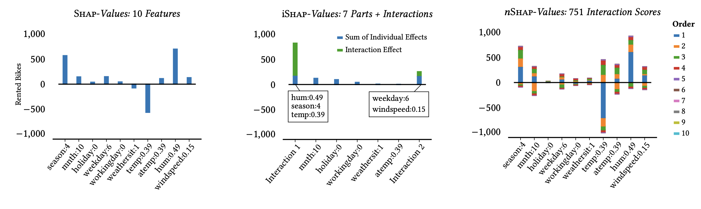

# iSHAP: Succinct Interaction-Aware Explanations (KDD 2025)

iShap is an interaction-aware Shapley value based explanation that partitions the feature set to 
inform about the most important feature interactions whilst providing the most accurate additive representation.
While SHAP [2]explanations are easy to interpret, they often overlook interactions between features, leading to incomplete or misleading insights. On the other hand, interaction-aware methods like nShap [3] provide exhaustive explanations but are often too large and complex to interpret effectively.

iShap bridges this gap by partitioning features into significantly interacting groups, creating succinct, interpretable, and additive explanations. To identify the optimal partitioning from many possibilities, iShap introduces a criterion balancing explanation complexity with representativeness. A statistical pruning method improves runtime and helps avoid spurious interactions.


*Comparison of Shap (left), our proposal iShap (middle) and 𝑛Shap (right) on the Bike Sharing dataset [4]. Shap
does not reveal interactions, 𝑛Shap returns non-zero scores for 751 out of 1024 feature sets (𝑛 = 𝑑). iShap provides a concise
explanation of 2 interactions for the high predicted demand: its is a dry and relatively warm winter day (Season:4, Hum:0.49
and Temp:0.39) and a Saturday with little wind (Weekday:6 and Windspeed:0.15).*

Experiments demonstrate that iShap more accurately reflects underlying model behavior than SHAP and nShap, and user studies indicate it is more interpretable and trustworthy.

## Features

- **Enhanced Interpretability**: Provides more interpretable SHAP values for complex models.
- **Synthetic and Real-World Data Support**: Includes experiments for both synthetic datasets and real-world scenarios.
- **User-Friendly Interface**: Designed for ease of use, facilitating quick integration into existing workflows.

## Installation

Clone the repository to your local machine:

```bash
git clone https://github.com/Schascha1/iSHAP.git
```

Navigate to the project directory:

```bash
cd iSHAP
```

Install the required dependencies:

```bash
pip install -r requirements.txt
```

## Usage

### Notebook
We provide a [notebook](example_usage.ipynb) that showcases how to run and visualize iSHAP on a common regression. 

### Running Synthetic Experiments

To execute the synthetic experiments as described in Section 5.1 of the associated paper, run:

```bash
bash run_synthetic_experiments.sh
```

### Running Real-World Experiments

For the real-world experiments detailed in Section 5.2 of the paper, execute:

```bash
bash run_interpolation_experiments.sh
```

## Repository Structure

- `data/`: Contains datasets used for experiments.
- `results/`: Stores the output and results from experiments.
- `scripts/`: Includes shell scripts to run experiments.
- `src/`: Source code for the iSHAP library.
- `notebooks/`: Jupyter notebooks demonstrating usage and experiments.

## License

This project is licensed under the MIT License. See the [LICENSE](https://github.com/Schascha1/iSHAP/blob/main/LICENSE) file for details.

## Citation

If you use iSHAP in your research, please cite the associated paper:

```bibtex
@inproceedings{ishap:xu:25,
  title={Succint Interaction-Aware Explanations},
  author={Xu, Sascha and C{\"u}ppers, Joscha and Vreeken, Jilles},
  booktitle = {Proceedings of the 30th ACM SIGKDD Conference on Knowledge Discovery and Data Mining},
  year={2025},
  url={https://openreview.net/forum?id=uXLXFWTaoT}
}
```

## Contact

For questions or support, please open an issue in the repository or contact [sascha.xu@cispa.de](mailto:sascha.xu@cispa.de).

---

This README provides an overview of the iSHAP project, its installation and usage. For detailed information, refer to the [associated paper](https://eda.rg.cispa.io/prj/ishap/). 

[1] Xu, Sascha, Joscha Cüppers, and Jilles Vreeken. "Succint Interaction-Aware Explanations." Proceedings of the 30th ACM SIGKDD Conference on Knowledge Discovery and Data Mining. 2025.

[2] Lundberg, Scott M., and Su-In Lee. "A Unified Approach to Interpreting Model Predictions." Advances in Neural Information Processing Systems 30 (2017).

[3] Bordt, Sebastian, and Ulrike von Luxburg. "From shapley values to generalized additive models and back." International Conference on Artificial Intelligence and Statistics. PMLR, 2023.

[4] Fanaee-T, Hadi, and Joao Gama. "Event labeling combining ensemble detectors and background knowledge." Progress in Artificial Intelligence 2 (2014): 113-127.